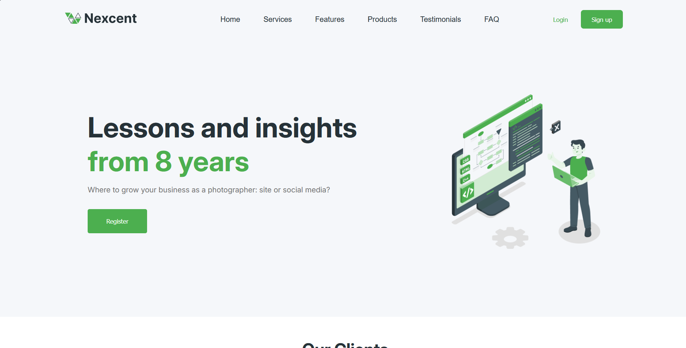

# Design Studio Landing Page

A responsive landing page for a digital design studio built with HTML and CSS.

## 🚀 Live Demo
https://darialozovska.github.io/design-studio-landing-page/

## 📌 About the Project
This project is a multi-section landing page created as part of my frontend learning journey.  
The goal was to practice layout building, working with Figma designs, and structuring a real-world website.

The page includes a hero section, clients, community cards, statistics, blog section, and footer.

## 🛠 Tech Stack
- HTML5
- CSS3 (Flexbox, Grid)
- Git & GitHub
- Figma (for design reference)

## ✨ Features
- Responsive layout structure
- Clean and semantic HTML
- Flexbox and Grid for layout
- Reusable container system
- Styled UI components (cards, buttons, navigation)

## 📷 Screenshots
*(you can add screenshots here later)*

## 📚 What I Learned
- How to structure a full landing page
- How to work with containers and layouts
- Difference between Flexbox and Grid
- How to translate a Figma design into code
- How to deploy a project using GitHub Pages

## 🔧 Future Improvements
- Add hover effects and animations
- Improve responsiveness for mobile devices
- Add JavaScript interactivity
- Refactor CSS for better scalability

## 👩‍💻 Author
GitHub: https://github.com/darialozovska

## 📷 Screenshots

